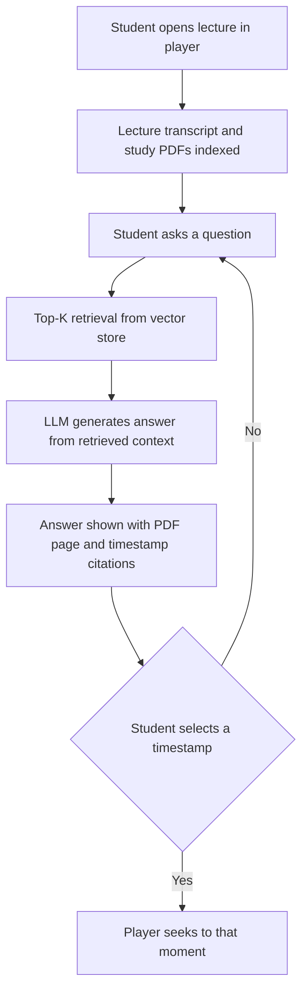

# AI Learning Companion

AI Learning Companion is a context-aware learning assistant designed to sit inside a lecture video player. It answers student questions using the lecture transcript and accompanying study material, and cites its sources as PDF pages and video timestamps.


---

## Overview

**What it is.** A retrieval-augmented generation (RAG) assistant intended to be embedded in a learning management system (LMS) video player. According to the project material, it is delivered as an SDK for web, Android and iOS.

**Problem addressed.** Students who have doubts while watching recorded lectures typically leave the player to consult a separate tool, and they struggle to locate a specific concept inside a long video.

**Intended users (per project material).** Students, educators, online EdTech platforms, coaching institutes and enterprises running training content.

**Core workflow (as documented).**

1. Lecture audio is transcribed and, together with study PDFs, is processed into searchable chunks.
2. The chunks are embedded and stored in a vector database.
3. A student question triggers a similarity search over those chunks.
4. A language model generates an answer from the retrieved context.
5. The answer is returned with references to PDF pages and video timestamps.

---

## Problem Statement

The project material identifies three problems.

| Problem | Description |
|---|---|
| Context switching | Students leave the video to resolve doubts in another tab or tool, which breaks their focus. |
| Finding concepts in long lectures | Locating one concept in a long recording requires manual timeline scrubbing. |
| Repetitive doubt-solving workload | Educators and platforms spend effort answering the same conceptual doubts repeatedly. |

The pitch deck attaches the following figures to these problems. They are claims from the project material. They are not independently verified, and no sources are given in the deck.

| Figure in deck | Context given in deck |
|---|---|
| 40% | Productivity loss from context switching |
| 30%+ | Share of revenue spent on tutors for repetitive doubts |

---

## Solution

The project proposes a native assistant inside the video player, backed by a knowledge base built from the lecture transcript and study PDFs. Answers are intended to be grounded in that content and to carry citations that let the student jump back to the source.

```text
Lecture audio + Study PDFs
          |
   Transcription / Ingestion
          |
   Chunking
          |
   Embeddings
          |
   Vector store
          |
   Top-K retrieval
          |
   LLM answer from retrieved context
          |
   Cited output (PDF page, video timestamp)
```

The pipeline above reflects the architecture slide of the pitch deck. The components named there are listed below. All of them are **Not verified in the current codebase.**

| Stage | Component named in deck |
|---|---|
| Speech to text | Whisper |
| Chunking | Semantic chunking |
| Vector store | ChromaDB |
| Retrieval | Top-K similarity search |
| Generation | LLM behind a model abstraction layer (Gemini, LLaMA 3 and GPT-4 are listed as examples) |
| Caching | Redis semantic cache (the deck states a 60% target reduction in API cost and latency, which is a target and not a measured result) |

---

## Key Features

Status values: **Documented (not verified)** means the feature appears in the pitch deck but could not be confirmed in a codebase. **Planned** means the deck places it on the roadmap.

| Feature | Status | Description |
|---|---|---|
| Embedded chat assistant in the video player | Documented (not verified) | Student asks questions about the current lecture without leaving the player. |
| Hybrid RAG over transcripts and PDFs | Documented (not verified) | Transcripts and study PDFs are merged into one shared vector knowledge base. |
| Source citations with PDF page and timestamp | Documented (not verified) | Each answer lists the PDF pages and lecture timestamps it drew on. |
| Click-to-seek timestamps | Documented (not verified) | Selecting a cited timestamp moves the player to that moment. |
| Semantic search within a video | Documented (not verified) | A keyword query highlights the moments on the timeline where the topic is discussed. |
| Smart Catch-Up | Documented (not verified) | On resuming after a pause, shows a summary of the lecture up to the paused timestamp. |
| Exam Mode | Documented (not verified) | Generates short notes, key questions and quizzes, exportable as a PDF. |
| Quiz remediation | Documented (not verified) | A wrong quiz answer seeks the video to the relevant explanation. |
| Model abstraction layer | Documented (not verified) | A single interface over multiple LLM providers. |
| Semantic response caching | Documented (not verified) | Repeated questions are served from a cache. |
| Web, Android and iOS SDK | Documented (not verified) | Embeddable SDK for LMS platforms. |
| Visual OCR (handwriting, blackboard, slides) | Planned | Reading on-screen content from video frames. |
| Confusion heatmaps | Planned | Teacher dashboard showing where students have doubts. |
| Personalized spaced repetition | Planned | Flashcards built from a student's weak areas. |
| Video chaptering, multilingual support, voice interaction, peer doubt network, learning analytics | Planned | Listed under "What's next" in the deck. |

### Claims in the deck that are not documented as features

The deck also makes security and infrastructure statements (end-to-end encryption, SOC 2-ready design, role-based access, audit logs, AWS, Docker, Kubernetes, CloudFront, WAF and DDoS protection, monitoring). It also makes outcome claims (learning efficiency up to 40%, engagement up to 60%, support costs down up to 30%, 80% of repetitive doubts solved, 70% of educator payroll saved). These are presentation claims. They are **Not verified in the current codebase**, and this README does not treat them as facts about the system.

---

## Current MVP

**Not verified in the current codebase.**

The pitch deck does not distinguish a working MVP from its target design, and no code was available to inspect. This section therefore cannot state what a user can do today. Complete the table below after auditing the repository, and include only behavior you have confirmed by running it.

| Question | Answer |
|---|---|
| What can a user do in the interface? | Not verified in the current codebase. |
| What content does the system ingest (video, audio, transcripts, PDFs)? | Not verified in the current codebase. |
| How is content chunked, embedded and stored? | Not verified in the current codebase. |
| Which LLM is used, and how is it called? | Not verified in the current codebase. |
| What does an answer contain (text, PDF page, timestamp)? | Not verified in the current codebase. |
| Is click-to-seek implemented in the player? | Not verified in the current codebase. |
| What does the backend expose (endpoints, services)? | Not verified in the current codebase. |
| Are there tests, and what do they cover? | Not verified in the current codebase. |

---

## User Flow

The flow below shows the **documented** interaction, not a confirmed implementation.


